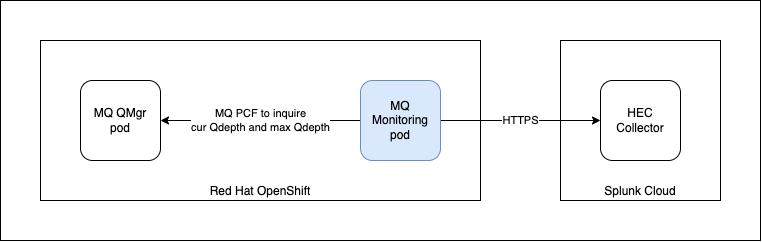

# MQ Monitor

This application is used to monitor the queue depth of an IBM MQ queue manager. It uses a PCF commands to inquire the current queue depth and the maximum queue manager. If it is above the defined "Red" or "Orange" threshold it will send a notification to Splunk. This is written in Springboot.



1. Use Maven to compile the code.

```
maven install
```

2. Build the image

*On Linux*
```
docker build -t mqmonitor:1.0.0 .
```
*On Mac M1 Chip*
```
docker buildx build --platform linux/amd64,linux/arm64 -t mqmonitor:1.0.0 .
```

3. Push image to docker.io (my sample)

```
docker tag mqmonitor:1.0.0 koksing/mqmonitor:1.0.0
docker push koksing/mqmonitor:1.0.0
```

4. Configure the secret.yaml. You need to configure the Splunk Token and Splunk Endpoint. You can register for a SplunkCloud trial. Once configured, you create a secret.

- **splunkToken**
- **splunkEndpoint**

```
oc apply -f secret.yaml -nmq
```

5. Configure the configmap in the deploy.yaml.

- **mqQueueManagerName**: Name of the MQ queue manager.
- **mqHostname**: On OpenShift, this is the services of the MQ queue manager.
- **mqPort**: This is the port of MQ traffic, usually is 1414.
- **mqChannelName**: This is the channel name.
- **mqGenericQueueName**: This is the "generic" queue name. You can used pattern like this "**TEST*".
- **monitorPeriod**: This is the monitor period. Recommended minimal is 60 seconds.
- **monitorThresholdRed**: This is the High threshold. Recomended is 0.9.
- **monitorThresholdAmber**: This is the Low threshold. Recommended is 0.5.

```
oc apply -f deploy.yaml -nmq
```

6. Configure **deploy.yaml**, if needed
