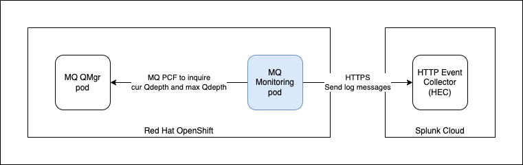

# MQ Monitor

This application is used to monitor the queue depth of an IBM MQ queue manager. It uses a PCF commands to inquire the current queue depth and the maximum queue manager. If it is above the defined "Red" or "Orange" threshold it will send a notification to Splunk. This is written in Springboot.



1. Use Maven to compile the code.

```
maven install
```

2. Build the image

*On Linux*
```
docker build -t mqmonitor:1.0.0 .
```
*On Mac M1 Chip*
```
docker buildx build --platform linux/amd64,linux/arm64 -t mqmonitor:1.0.0 .
```

3. Push image to docker.io (my sample)

```
docker tag mqmonitor:1.0.0 koksing/mqmonitor:1.0.0
docker push koksing/mqmonitor:1.0.0
```

4. Configure the secret.yaml. You need to configure the Splunk Token and Splunk Endpoint. You can register for a SplunkCloud trial. Once configured, you create a secret.

| Field | Description |
| ----- | ----------- |
| **splunkToken** | The token that is obtained when you configure HTTP Event Collector (HEC). This is base64 encoded |
| **splunkEndpoint** | The endpoint of Splunk HTTP Event Collector (HEC). This is base64 encoded |
| **mqTlsKeystore** | The content of the JKS keystore file. This is base64 encoded. |
| **mqTlsKeystorePassword** | Password of the JKS keystore file. This is base64 encoded. |
| **mqTlsTruststore** | The content of the JKS truststore file. This is base64 encoded. |
| **mqTlsTruststorePassword** | Password of the JKS truststore file. This is base64 encoded. |

```
oc apply -f secret.yaml -nmq
```

5. Configure the configmap in the deploy.yaml.

| Field | Description |
| ----- | ------------|
| **mqQueueManagerName** | Name of the MQ queue manager. |
| **mqHostname** | On OpenShift, this is the Kubernetes service of the MQ queue manager. |
| **mqPort** | This is the port of MQ traffic, usually is 1414. |
| **mqChannelName** | This is the channel name. In this example, there are 3 options QM2CHL for no TLS, QM2CHL_TLS for TLS and QM2CHL_MTLS for mutual TLS. |
| **mqGenericQueueName** | This is the "generic" queue name. You can used pattern like this "**TEST*". |
| **mqTlsMode** | This set the mode of TLS, none for no TLS, tls for TLS and mtls for mutual TLS. |
| **mqTlsDebug** | Enable or disable debugging mode for TLS communications. |
| **mqTlsCipherSuite** | Refer to the [documentation](https://www.ibm.com/docs/en/ibm-mq/9.3?topic=jms-tls-cipherspecs-ciphersuites-in-mq-classes) for valid supported. |
| **mqTlsKeystoreFilename** | Specify the location of the keystore, depending on how the secret is mapped to volume. |
| **mqTlsKeystoreType** | JKS or PKCS12 |
| **mqTlsTruststoreFilename** | Specify the location of the truststore, depending on how the secret is mapped to volume. |
| **mqTlsTruststoreType** | JKS or PKCS12 |
| **monitorPeriod** | This is the monitor period. Recommended minimal is 60 seconds. |
| **monitorThresholdRed** |This is the High threshold. Recomended is 0.9. |
| **monitorThresholdAmber** | This is the Low threshold. Recommended is 0.5. |

```
oc apply -f deploy.yaml -nmq
```

6. Configure **deploy.yaml**, where needed, e.g. the location to pull the image. In this example, I am pulling from my personal Dockerhub registry.

```
spec:
  replicas: 1
  selector:
    matchLabels:
      app: mqmonitor
  template:
    metadata:
      labels:
        app: mqmonitor
    spec:
      containers:
        - name: mqmonitor
          image: docker.io/koksing/mqmonitor:1.0.0
          imagePullPolicy: Always
          resources:
            requests:
              memory: "512Mi"
              cpu: "250m"
            limits:
              memory: "1024Mi"
              cpu: "500m"
```